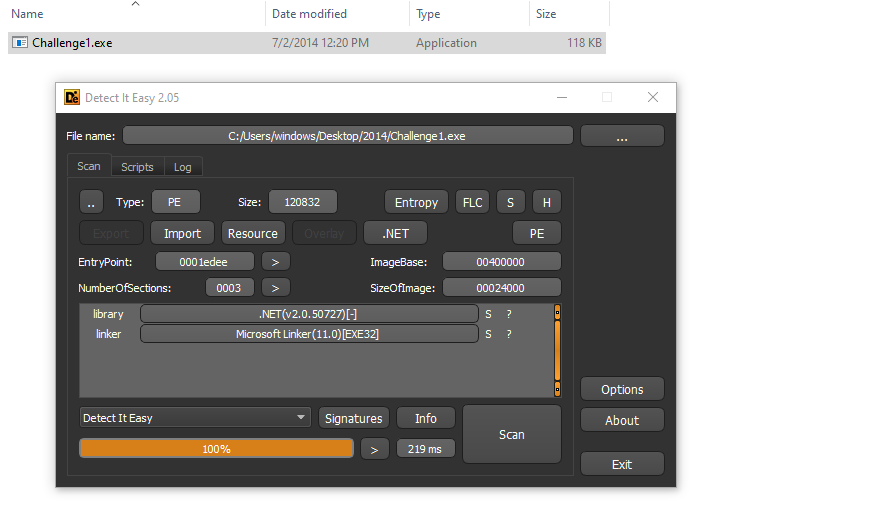
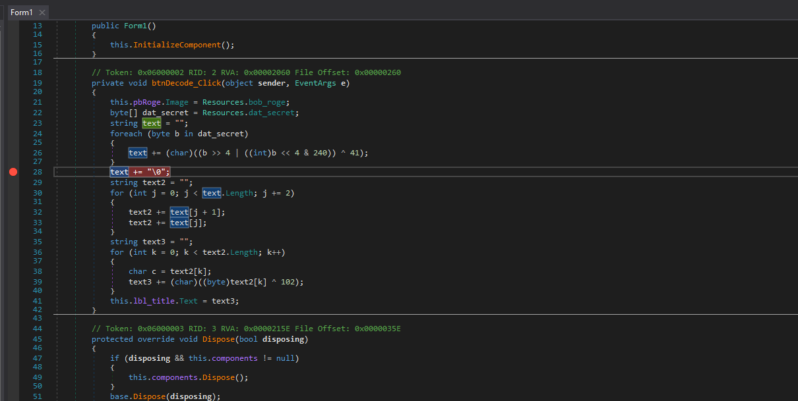
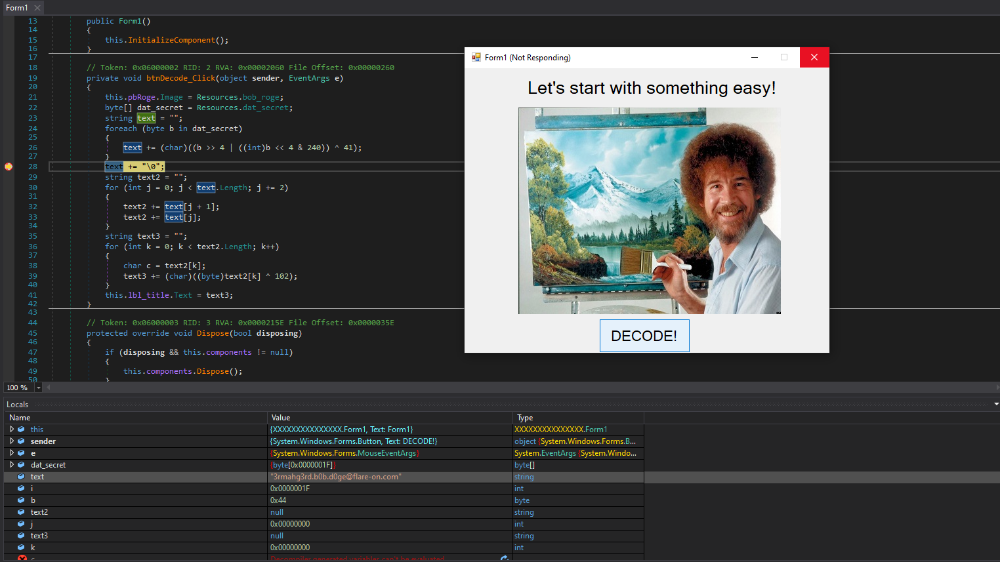

# Challenge 1 : Bob Doge

Öncelikli olarak indirdiğimiz zip dosyasının içerisinden çıkan C1.exe isimli dosyamızın adını C1.zip yapalım ve içerisinde bulunan `Challenge 1` isimli exe dosyamızı çıkartalım.

Daha sonra dosyamızı `DIE` (Detect It Easy) aracımıza atıp inceleyelim

Henüz bu işlerde çok yeniyim ancak .NET gördüğümüz zaman `dnspy` aracını kullanmakta fayda olduğunu düşünüyorum (Belki başka püf noktalarda vardır, öğreneceğiz)

Programımızın içerisinde bir adet form var. Bu formu incelediğimiz zaman `btnDecode_Click` isimli fonksiyon dikkatimizi çekecektir. Bunun içerisine bir adet breakpoint koyarak programımızı çalıştırırsak bakalım ne olacak.

Açılan ekranda `decode` et butonuna basalım ve...

Bingo ! ilk text değişkenimizin içerisinde aramış olduğumuz adresi bulduk :)
