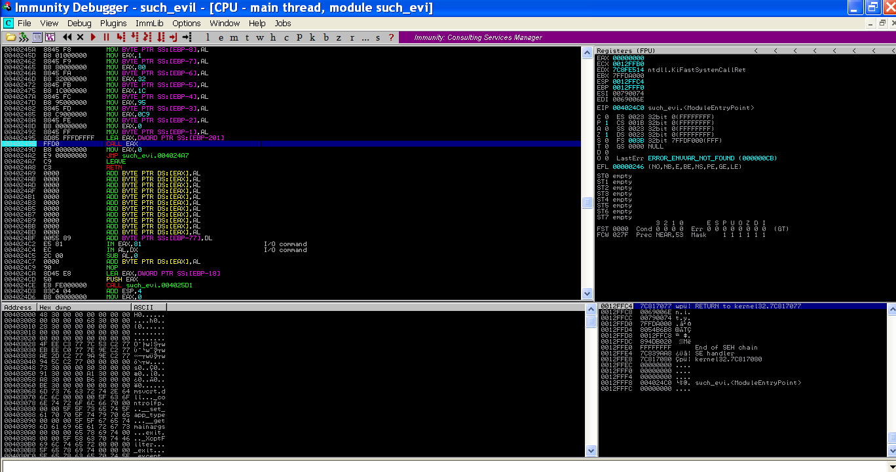
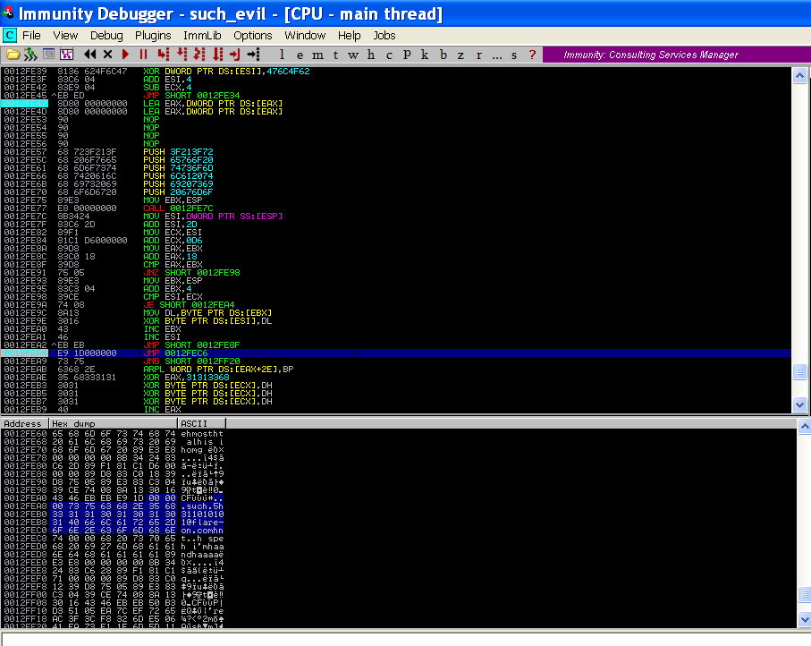

# Challenge 3: Shellolololol

C3.zip içerisinden `such_evil` isimli bir dosya çıktı. Bu dosyayı `IDA` üzerinde açıp bir bakalım neyin nesiymiş.

`start` fonksiyonu içerisinde pek fazla birşey yok. Aşağıda `sub_401000` isimli fonksiyon çağrılmış. Ona da bir bakalım

Burda `eax` registerına birşeyler yazılıyor daha sonra da `al` registerı üzerinden stack içerisine birşeyler yazılıyor. En sonda da `eax` registerında yazan adres çağrılıyor. O adresle işi bittikten sonrada sıfırlanıyor.

Büyük ihtimalle stack içerisine yazmış olduğu değerleri `eax` üzerinden bir adrese giderek orada kullanıyordur. Bunu daha iyi anlamak için programımızı debuggerda açalım.

`call eax` işleminin gerçekleştiği yere breakpoint koyup çalıştıralım. breakpoint noktamıza geldiğimizde de `F7`'ye basarak çağrılan adrese gidelim

Burda bir loop var ve bu loopun içerisinde de `xor` işlemi gerçekleştiriliyor. Sonucun ne olduğunu görmek için `JMP 0012FDB0` noktasına breakpoint koyalım ve devam edelim.

Hmm ufaktan birşeyler yazmaya başladı sanki. Biraz daha ilerlersek aşağıda bir loop daha olduğunu ve sürekli birşeyleri `xor` işleminden geçirdiğini görebiliriz. Onun da sonuna bir breakpoint koyalım ve ilerleyelim

Evet sanırım doğru yoldayız, o zaman durmak yok yola devam.

Karşımıza bir loop daha çıktı onunda sonuna breakpoint koyup hızlıca ilerleyelim . Tabi biter mi bitmez :D İlerde bir loop işlemi daha var onun da sonuna breakpoint koyalım

Veee koyduğumuz son breakpointe geldiğimizde hemen altında bulunan kısımda `flag` adresimiz gözüktü

