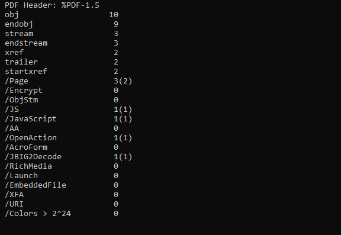
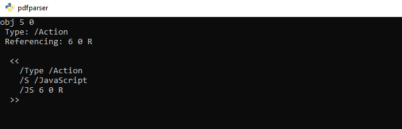
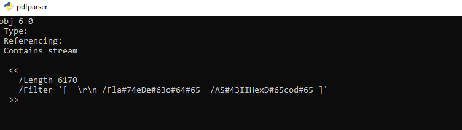
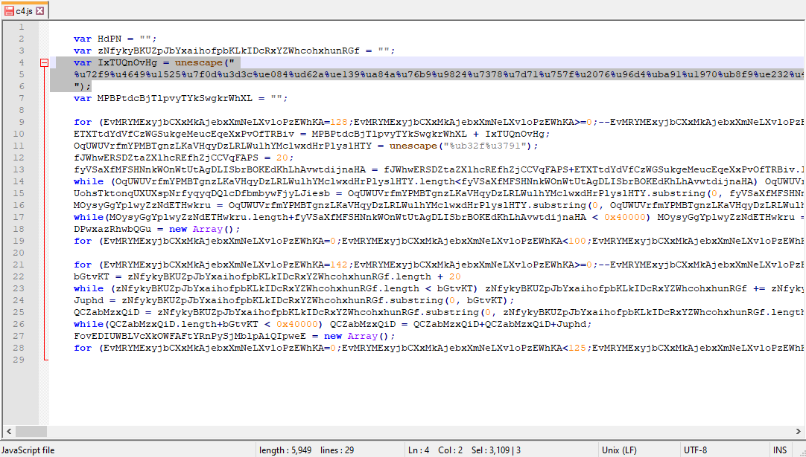
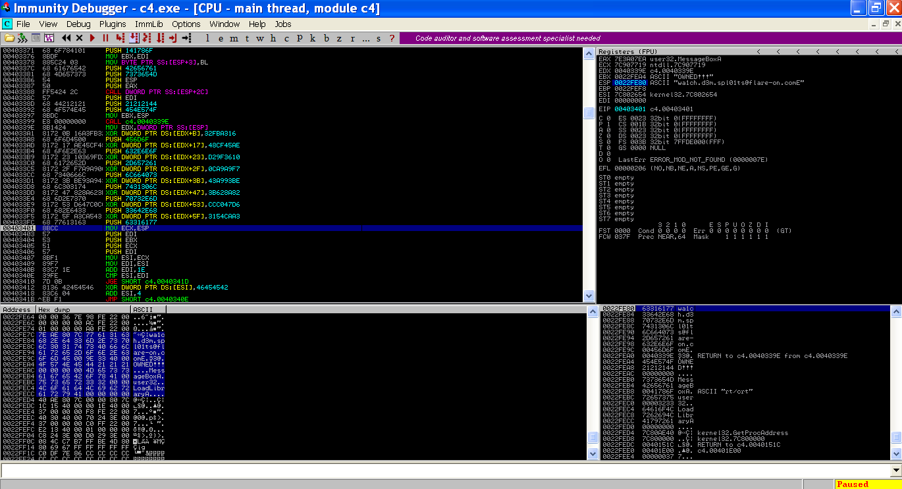

# Challenge 4: Sploitastic

C4.zip dosyamızı açtığımız zaman bize bir adet pdf dosyası veriyor. Bu dosyanın içerisine gömülmüş herhangi birşey varmı diye kontrol etmek amaçlı `pdfid` isimli python scriptimizi çalıştırıyoruz.

     .\pdfid.lnk C:\pdf path\APT9001.pdf



Hmm şüphelendiğimiz gibi içerisinde bir javascript kodu olduğunu söylüyor. Detayları öğrenmek için `pdfparser` isimli python scriptimiz ile bakalım

     .\pdfparser.lnk -s javascript C:\pdf path\APT9001.pdf




    .\pdfparser.lnk -o 6 C:\pdf path\APT9001.pdf



Artık içindeki kodu çıkaralım

    .\pdfparser.lnk -o 6 -d c4.js -f C:\pdf path\APT9001.pdf

Ve c4.js dosyamızı açalım



Bunun ne anlama geldiğini bulmak biraz zamanımı aldı ama sonunda öğrendim. Şöyle ki `%u72f9`'un karşılığı `0xf972` oluyormuş. Hepsini bu şekilde çevirdiğimiz zamanda ortaya bir shellcode çıkıyormuş.

Bunun için hızlıca bir python scripti yazdım

```python
str = "%u72f9%u4649%u1525%u7f0d%u3d3c%ue084%ud62a%ue139%ua84a%u76b9%u9824%u7378%u7d71%u757f%u2076%u96d4%uba91%u1970%ub8f9%ue232%u467b%u9ba8%ufe01%uc7c6%ue3c1%u7e24%u437c%ue180%ub115%ub3b2%u4f66%u27b6%u9f3c%u7a4e%u412d%ubbbf%u7705%uf528%u9293%u9990%ua998%u0a47%u14eb%u3d49%u484b%u372f%ub98d%u3478%u0bb4%ud5d2%ue031%u3572%ud610%u6740%u2bbe%u4afd%u041c%u3f97%ufc3a%u7479%u421d%ub7b5%u0c2c%u130d%u25f8%u76b0%u4e79%u7bb1%u0c66%u2dbb%u911c%ua92f%ub82c%u8db0%u0d7e%u3b96%u49d4%ud56b%u03b7%ue1f7%u467d%u77b9%u3d42%u111d%u67e0%u4b92%ueb85%u2471%u9b48%uf902%u4f15%u04ba%ue300%u8727%u9fd6%u4770%u187a%u73e2%ufd1b%u2574%u437c%u4190%u97b6%u1499%u783c%u8337%ub3f8%u7235%u693f%u98f5%u7fbe%u4a75%ub493%ub5a8%u21bf%ufcd0%u3440%u057b%ub2b2%u7c71%u814e%u22e1%u04eb%u884a%u2ce2%u492d%u8d42%u75b3%uf523%u727f%ufc0b%u0197%ud3f7%u90f9%u41be%ua81c%u7d25%ub135%u7978%uf80a%ufd32%u769b%u921d%ubbb4%u77b8%u707e%u4073%u0c7a%ud689%u2491%u1446%u9fba%uc087%u0dd4%u4bb0%ub62f%ue381%u0574%u3fb9%u1b67%u93d5%u8396%u66e0%u47b5%u98b7%u153c%ua934%u3748%u3d27%u4f75%u8cbf%u43e2%ub899%u3873%u7deb%u257a%uf985%ubb8d%u7f91%u9667%ub292%u4879%u4a3c%ud433%u97a9%u377e%ub347%u933d%u0524%u9f3f%ue139%u3571%u23b4%ua8d6%u8814%uf8d1%u4272%u76ba%ufd08%ube41%ub54b%u150d%u4377%u1174%u78e3%ue020%u041c%u40bf%ud510%ub727%u70b1%uf52b%u222f%u4efc%u989b%u901d%ub62c%u4f7c%u342d%u0c66%ub099%u7b49%u787a%u7f7e%u7d73%ub946%ub091%u928d%u90bf%u21b7%ue0f6%u134b%u29f5%u67eb%u2577%ue186%u2a05%u66d6%ua8b9%u1535%u4296%u3498%ub199%ub4ba%ub52c%uf812%u4f93%u7b76%u3079%ubefd%u3f71%u4e40%u7cb3%u2775%ue209%u4324%u0c70%u182d%u02e3%u4af9%ubb47%u41b6%u729f%u9748%ud480%ud528%u749b%u1c3c%ufc84%u497d%u7eb8%ud26b%u1de0%u0d76%u3174%u14eb%u3770%u71a9%u723d%ub246%u2f78%u047f%ub6a9%u1c7b%u3a73%u3ce1%u19be%u34f9%ud500%u037a%ue2f8%ub024%ufd4e%u3d79%u7596%u9b15%u7c49%ub42f%u9f4f%u4799%uc13b%ue3d0%u4014%u903f%u41bf%u4397%ub88d%ub548%u0d77%u4ab2%u2d93%u9267%ub198%ufc1a%ud4b9%ub32c%ubaf5%u690c%u91d6%u04a8%u1dbb%u4666%u2505%u35b7%u3742%u4b27%ufc90%ud233%u30b2%uff64%u5a32%u528b%u8b0c%u1452%u728b%u3328%ub1c9%u3318%u33ff%uacc0%u613c%u027c%u202c%ucfc1%u030d%ue2f8%u81f0%u5bff%u4abc%u8b6a%u105a%u128b%uda75%u538b%u033c%uffd3%u3472%u528b%u0378%u8bd3%u2072%uf303%uc933%uad41%uc303%u3881%u6547%u5074%uf475%u7881%u7204%u636f%u7541%u81eb%u0878%u6464%u6572%ue275%u8b49%u2472%uf303%u8b66%u4e0c%u728b%u031c%u8bf3%u8e14%ud303%u3352%u57ff%u6168%u7972%u6841%u694c%u7262%u4c68%u616f%u5464%uff53%u68d2%u3233%u0101%u8966%u247c%u6802%u7375%u7265%uff54%u68d0%u786f%u0141%udf8b%u5c88%u0324%u6168%u6567%u6842%u654d%u7373%u5054%u54ff%u2c24%u6857%u2144%u2121%u4f68%u4e57%u8b45%ue8dc%u0000%u0000%u148b%u8124%u0b72%ua316%u32fb%u7968%ubece%u8132%u1772%u45ae%u48cf%uc168%ue12b%u812b%u2372%u3610%ud29f%u7168%ufa44%u81ff%u2f72%ua9f7%u0ca9%u8468%ucfe9%u8160%u3b72%u93be%u43a9%ud268%u98a3%u8137%u4772%u8a82%u3b62%uef68%u11a4%u814b%u5372%u47d6%uccc0%ube68%ua469%u81ff%u5f72%ucaa3%u3154%ud468%u65ab%u8b52%u57cc%u5153%u8b57%u89f1%u83f7%u1ec7%ufe39%u0b7d%u3681%u4542%u4645%uc683%ueb04%ufff1%u68d0%u7365%u0173%udf8b%u5c88%u0324%u5068%u6f72%u6863%u7845%u7469%uff54%u2474%uff40%u2454%u5740%ud0ff"

yeni = list(range(len(str)))
j = 0

for i in str:
  yeni[j] = i
  j += 1

shellcode = ""

for x in range(len(yeni)):
  if yeni[x] == "%":
    shellcode += "\\x"
    shellcode += yeni[x+4]
    shellcode += yeni[x+5]
    shellcode += "\\x"
    shellcode += yeni[x+2]
    shellcode += yeni[x+3]
  else:
    continue

print(shellcode)
```

Ve scriptimi çalıştırdığım zaman bana shellcode'u verdi

```
\xf9\x72\x49\x46\x25\x15\x0d\x7f\x3c\x3d\x84\xe0\x2a\xd6\x39\xe1\x4a\xa8\xb9\x76\x24\x98\x78\x73\x71\x7d\x7f\x75\x76\x20\xd4\x96\x91\xba\x70\x19\xf9\xb8\x32\xe2\x7b\x46\xa8\x9b\x01\xfe\xc6\xc7\xc1\xe3\x24\x7e\x7c\x43\x80\xe1\x15\xb1\xb2\xb3\x66\x4f\xb6\x27\x3c\x9f\x4e\x7a\x2d\x41\xbf\xbb\x05\x77\x28\xf5\x93\x92\x90\x99\x98\xa9\x47\x0a\xeb\x14\x49\x3d\x4b\x48\x2f\x37\x8d\xb9\x78\x34\xb4\x0b\xd2\xd5\x31\xe0\x72\x35\x10\xd6\x40\x67\xbe\x2b\xfd\x4a\x1c\x04\x97\x3f\x3a\xfc\x79\x74\x1d\x42\xb5\xb7\x2c\x0c\x0d\x13\xf8\x25\xb0\x76\x79\x4e\xb1\x7b\x66\x0c\xbb\x2d\x1c\x91\x2f\xa9\x2c\xb8\xb0\x8d\x7e\x0d\x96\x3b\xd4\x49\x6b\xd5\xb7\x03\xf7\xe1\x7d\x46\xb9\x77\x42\x3d\x1d\x11\xe0\x67\x92\x4b\x85\xeb\x71\x24\x48\x9b\x02\xf9\x15\x4f\xba\x04\x00\xe3\x27\x87\xd6\x9f\x70\x47\x7a\x18\xe2\x73\x1b\xfd\x74\x25\x7c\x43\x90\x41\xb6\x97\x99\x14\x3c\x78\x37\x83\xf8\xb3\x35\x72\x3f\x69\xf5\x98\xbe\x7f\x75\x4a\x93\xb4\xa8\xb5\xbf\x21\xd0\xfc\x40\x34\x7b\x05\xb2\xb2\x71\x7c\x4e\x81\xe1\x22\xeb\x04\x4a\x88\xe2\x2c\x2d\x49\x42\x8d\xb3\x75\x23\xf5\x7f\x72\x0b\xfc\x97\x01\xf7\xd3\xf9\x90\xbe\x41\x1c\xa8\x25\x7d\x35\xb1\x78\x79\x0a\xf8\x32\xfd\x9b\x76\x1d\x92\xb4\xbb\xb8\x77\x7e\x70\x73\x40\x7a\x0c\x89\xd6\x91\x24\x46\x14\xba\x9f\x87\xc0\xd4\x0d\xb0\x4b\x2f\xb6\x81\xe3\x74\x05\xb9\x3f\x67\x1b\xd5\x93\x96\x83\xe0\x66\xb5\x47\xb7\x98\x3c\x15\x34\xa9\x48\x37\x27\x3d\x75\x4f\xbf\x8c\xe2\x43\x99\xb8\x73\x38\xeb\x7d\x7a\x25\x85\xf9\x8d\xbb\x91\x7f\x67\x96\x92\xb2\x79\x48\x3c\x4a\x33\xd4\xa9\x97\x7e\x37\x47\xb3\x3d\x93\x24\x05\x3f\x9f\x39\xe1\x71\x35\xb4\x23\xd6\xa8\x14\x88\xd1\xf8\x72\x42\xba\x76\x08\xfd\x41\xbe\x4b\xb5\x0d\x15\x77\x43\x74\x11\xe3\x78\x20\xe0\x1c\x04\xbf\x40\x10\xd5\x27\xb7\xb1\x70\x2b\xf5\x2f\x22\xfc\x4e\x9b\x98\x1d\x90\x2c\xb6\x7c\x4f\x2d\x34\x66\x0c\x99\xb0\x49\x7b\x7a\x78\x7e\x7f\x73\x7d\x46\xb9\x91\xb0\x8d\x92\xbf\x90\xb7\x21\xf6\xe0\x4b\x13\xf5\x29\xeb\x67\x77\x25\x86\xe1\x05\x2a\xd6\x66\xb9\xa8\x35\x15\x96\x42\x98\x34\x99\xb1\xba\xb4\x2c\xb5\x12\xf8\x93\x4f\x76\x7b\x79\x30\xfd\xbe\x71\x3f\x40\x4e\xb3\x7c\x75\x27\x09\xe2\x24\x43\x70\x0c\x2d\x18\xe3\x02\xf9\x4a\x47\xbb\xb6\x41\x9f\x72\x48\x97\x80\xd4\x28\xd5\x9b\x74\x3c\x1c\x84\xfc\x7d\x49\xb8\x7e\x6b\xd2\xe0\x1d\x76\x0d\x74\x31\xeb\x14\x70\x37\xa9\x71\x3d\x72\x46\xb2\x78\x2f\x7f\x04\xa9\xb6\x7b\x1c\x73\x3a\xe1\x3c\xbe\x19\xf9\x34\x00\xd5\x7a\x03\xf8\xe2\x24\xb0\x4e\xfd\x79\x3d\x96\x75\x15\x9b\x49\x7c\x2f\xb4\x4f\x9f\x99\x47\x3b\xc1\xd0\xe3\x14\x40\x3f\x90\xbf\x41\x97\x43\x8d\xb8\x48\xb5\x77\x0d\xb2\x4a\x93\x2d\x67\x92\x98\xb1\x1a\xfc\xb9\xd4\x2c\xb3\xf5\xba\x0c\x69\xd6\x91\xa8\x04\xbb\x1d\x66\x46\x05\x25\xb7\x35\x42\x37\x27\x4b\x90\xfc\x33\xd2\xb2\x30\x64\xff\x32\x5a\x8b\x52\x0c\x8b\x52\x14\x8b\x72\x28\x33\xc9\xb1\x18\x33\xff\x33\xc0\xac\x3c\x61\x7c\x02\x2c\x20\xc1\xcf\x0d\x03\xf8\xe2\xf0\x81\xff\x5b\xbc\x4a\x6a\x8b\x5a\x10\x8b\x12\x75\xda\x8b\x53\x3c\x03\xd3\xff\x72\x34\x8b\x52\x78\x03\xd3\x8b\x72\x20\x03\xf3\x33\xc9\x41\xad\x03\xc3\x81\x38\x47\x65\x74\x50\x75\xf4\x81\x78\x04\x72\x6f\x63\x41\x75\xeb\x81\x78\x08\x64\x64\x72\x65\x75\xe2\x49\x8b\x72\x24\x03\xf3\x66\x8b\x0c\x4e\x8b\x72\x1c\x03\xf3\x8b\x14\x8e\x03\xd3\x52\x33\xff\x57\x68\x61\x72\x79\x41\x68\x4c\x69\x62\x72\x68\x4c\x6f\x61\x64\x54\x53\xff\xd2\x68\x33\x32\x01\x01\x66\x89\x7c\x24\x02\x68\x75\x73\x65\x72\x54\xff\xd0\x68\x6f\x78\x41\x01\x8b\xdf\x88\x5c\x24\x03\x68\x61\x67\x65\x42\x68\x4d\x65\x73\x73\x54\x50\xff\x54\x24\x2c\x57\x68\x44\x21\x21\x21\x68\x4f\x57\x4e\x45\x8b\xdc\xe8\x00\x00\x00\x00\x8b\x14\x24\x81\x72\x0b\x16\xa3\xfb\x32\x68\x79\xce\xbe\x32\x81\x72\x17\xae\x45\xcf\x48\x68\xc1\x2b\xe1\x2b\x81\x72\x23\x10\x36\x9f\xd2\x68\x71\x44\xfa\xff\x81\x72\x2f\xf7\xa9\xa9\x0c\x68\x84\xe9\xcf\x60\x81\x72\x3b\xbe\x93\xa9\x43\x68\xd2\xa3\x98\x37\x81\x72\x47\x82\x8a\x62\x3b\x68\xef\xa4\x11\x4b\x81\x72\x53\xd6\x47\xc0\xcc\x68\xbe\x69\xa4\xff\x81\x72\x5f\xa3\xca\x54\x31\x68\xd4\xab\x65\x52\x8b\xcc\x57\x53\x51\x57\x8b\xf1\x89\xf7\x83\xc7\x1e\x39\xfe\x7d\x0b\x81\x36\x42\x45\x45\x46\x83\xc6\x04\xeb\xf1\xff\xd0\x68\x65\x73\x73\x01\x8b\xdf\x88\x5c\x24\x03\x68\x50\x72\x6f\x63\x68\x45\x78\x69\x74\x54\xff\x74\x24\x40\xff\x54\x24\x40\x57\xff\xd0
```

Artık tek yapmamız gereken bu shellcode'u x86 mimaride çalışacak bir `exe`'ye dönüştürmek.

```c
#include <stdio.h>
#include <stdlib.h>
#include <windows.h>

char shellcode[] = ""

int main(int argc, char **argv)
{
   int (*func)();
   func = (int (*)()) shellcode;
   (int)(*func)();
}
```
**

Şöyle bir kod buldum ve `shellcode` yazan yere yukarda yazan shellcode'u koydum.

Daha sonra oluşturduğum exe'yi debugger üzerinde açtım ve adım adım ilerlettim Sonlara doğru yaklaştığımda sağ tarafta registerın üzerine aradığım adresin yazıldığını farkettim :)



Ve işte bu kadar. Biraz daha ilerlersek program ekrana `OWNED` yazan bir pencere açarak anlamsız bir yazı yazacaktır.
