# Challenge 5: 5get_it

C5.zip içerisinden `5get_it` isimli bir dosya çıkmakta. Bu dosyayı `IDA` ile açıp incelemeye başladığımızda bir sürü fonksiyon olduğunu görüyouz. Bunlara hızlıca göz atarken dikkatimizi bir tanesi çekiyor.

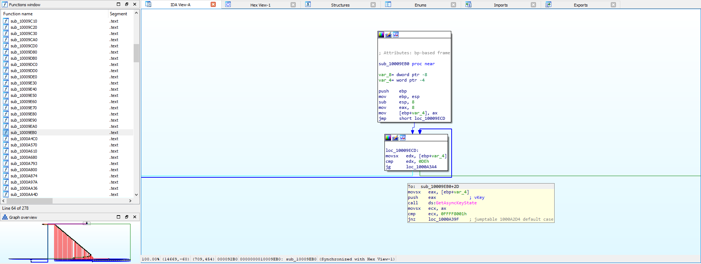

Burda `GetAsyncKeyState` isimli bir fonksiyon mevcut ki bu programımızın keylogger mı acaba diye düşünmemize yol açacakken sağ tarafta bulunan if/else bloklarını bunu biraz destekliyor sanırım

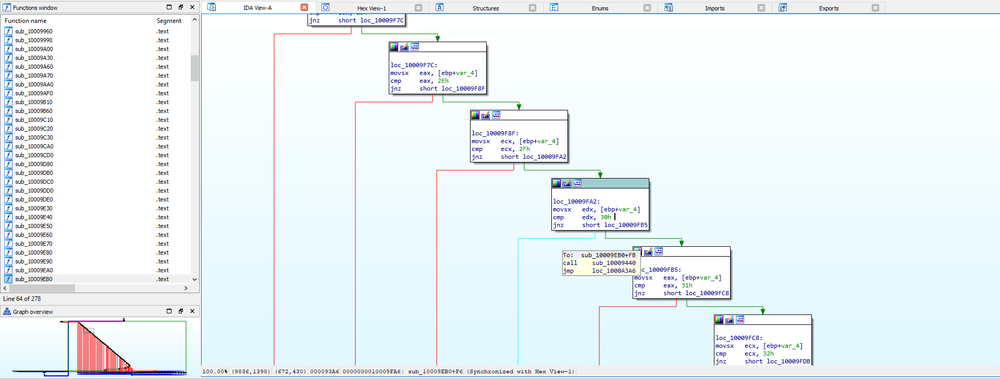

If/else içerisinden `0x30` yani `0` karakteri geldiği zaman ne yapıyormuş bir bakalım

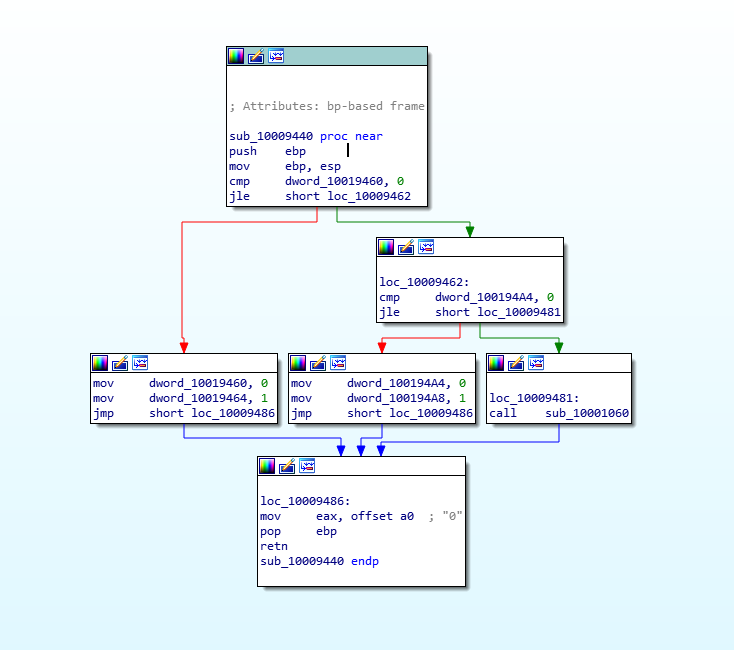

Başka bir addresi `call` ediyor ki bu adresin içeriği yukarıdaki resimde görmüş olduğunuz gibi. Daha sonra işi bitince jmp işlemi gerçekleştirerek aynı döngüye devam ediyor.

Burada `dword_10019460` değerinin 1 olması durumunda bu değer sıfırlanacak `dword_10019464` değeri 1 olacak ve `0` karakteri eax'a taşınacak. Peki böyle bir fonksiyon tüm karakterler için geçerli mi ?

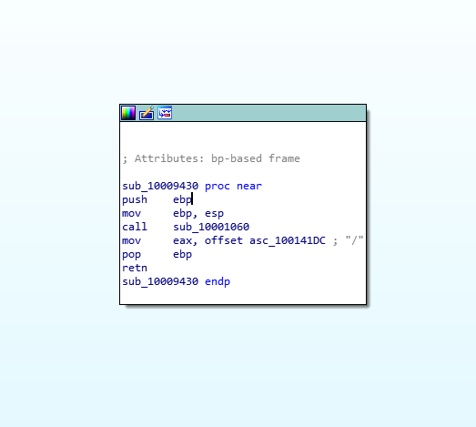

`0x2f` yani "/" karakterinin çağırmış olduğu fonksiyonda böyle bir durum yok. O zaman bu durumun flag ile bir ilgisi olabilir mi acaba ?

Bunun için `dword_10019460` ve `dword_10019464` bir arada olduğu başka yerler de var mı acaba diye bakalım.

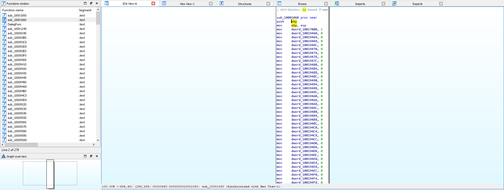

Flag değerine ulaşmak için bize hangi sırayı takip etmemiz gerektiğini söylemiş olabilir. İlk değeri `1` olarak ve diğer değerleri `0` olarak vermiş. Yani ilk değer `cmp dword_10017000, 0` kontrolü sonrasında `mov dword_10017000, 0 && mov dword_10019460, 1` olarak değiştirilecek ve en altta yazan karakterde bizim flag adresimizdeki ilk karakter olmuş olacak. Daha sonra `dword_10019460` karakteri 0 ile karşılaştırılacak ve 0 olmadığı için `mov dword_10019460, 0  && mov dword_10019464, 1` olarak değiştirilecek. Altında yazan karakterde flag adresinin ikinci karakteri olacak. Böyle böyle devam edeceğiz.

Biraz uğraştırıcı ve zaman alacak bir yöntem ancak başka yoldan nasıl yapılır bilmiyorum :/

İlk karakterimiz `l`

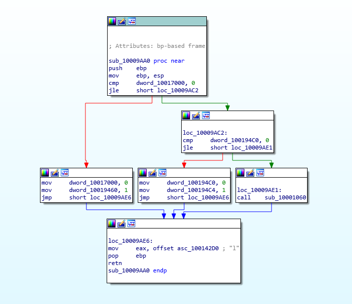

İkinci karakterimiz `0`

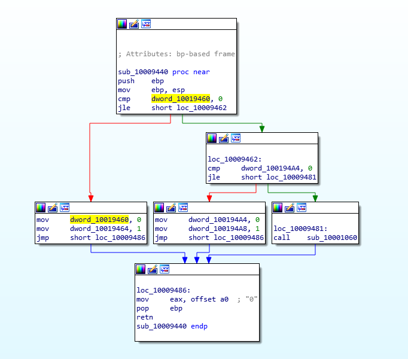

`NOT :` Bir sonraki adresin konumuna hızlıca gitmek için o adresi seçip `X` tuşuna basın, sonra `cmp` komutu olan seçeneğe basıp hızlıca aradığımız konuma gidebilirsiniz.

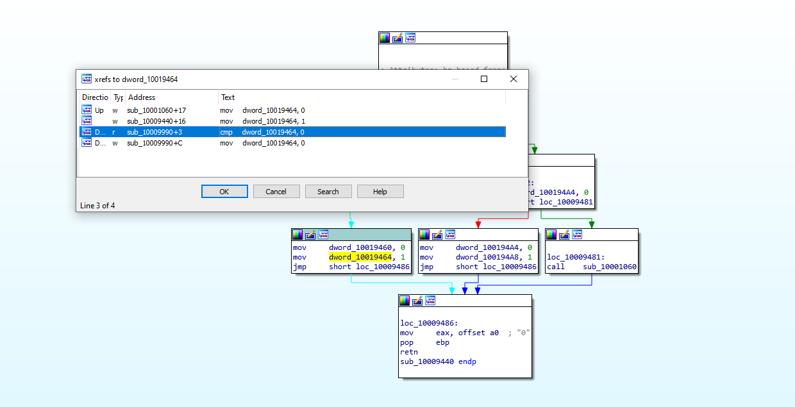

Üçüncü karakterimiz `g`

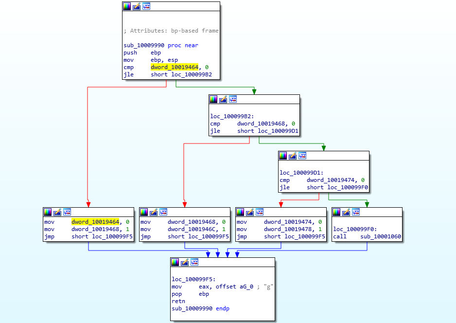

`cmp dword_10019468` karşılaştırmasıda bu fonksiyonda olduğu için `dördüncü` karakterde `g` olacak

Beşinci karakterimiz `i`

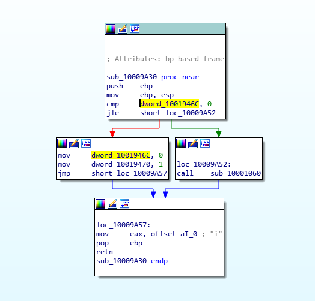

Bu şekilde tek tek not alarak devam edelim...

Ve son harf `m`

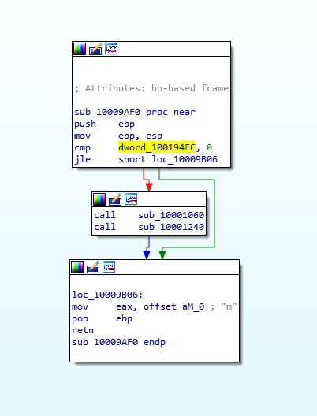

Flag adresimiz `loggingdotUrdot5tr0ke5atflaredashondotcom` yani `logging.Ur.5tr0ke5@flare-on.com`
